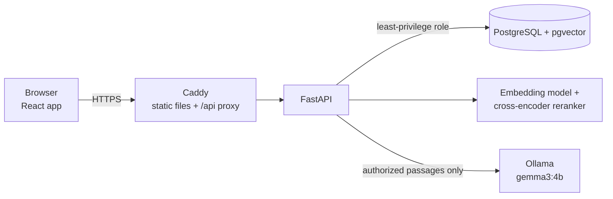

# Enterprise Knowledge Assistant

A private, self-hosted assistant that answers employees' questions from their company's own documents, with
citations, and **only from the documents each person is allowed to read**.

It is a retrieval-augmented generation (RAG) application:
- **Backend:** FastAPI;
- **Search:** PostgreSQL with pgvector, plus a cross-encoder reranker;
- **Answers:** a local LLM served by Ollama, so document text never leaves your server;
- **Frontend:** React.

Access control is enforced inside the database query, before anything is ranked or sent to the model.

```
Employee (Engineering): "What is the on-call response for a Sev-1 incident?"

Assistant: The SRE On-Call is 24x7 for Sev0/Sev1 platform incidents [3]. The Platform On-Call is
           24x5 with after-hours escalation for Sev0/Sev1 [3] ...

Sources ▸  [3] escalation-paths-and-contacts-2026.txt   (only documents this employee may read)
```

---

## Contents

- [Why this exists](#why-this-exists)
- [Features](#features)
- [How it works](#how-it-works)
- [Quick start with Docker](#quick-start-with-docker)
- [Local development](#local-development)
- [Configuration](#configuration)
- [Using the application](#using-the-application)
- [Security model](#security-model)
- [Testing](#testing)
- [Project layout](#project-layout)
- [Further documentation](#further-documentation)

## Why this exists

Company knowledge is spread across hundreds of handbooks, policies, runbooks and meeting notes, and much of it is
restricted. Finance shouldn't read HR case files, and contractors shouldn't see the security runbooks. A generic
chatbot either can't see the documents or sees all of them.

This project answers questions **from the documents themselves**, **cites every statement**, and **never uses a
document the person asking could not open**. Answers are generated locally, so confidential text never goes to a
third-party API.

## Features

**Answers you can check**
- Answers in plain language, with numbered citations `[1]`, `[2]` that point to the exact passages used.
- Citations are verified: a citation the model makes up is removed, and sources are always built from the
  system's own retrieval results, never from the model's text.
- If the documents don't contain the answer, it says so instead of guessing.
- A "sources only" mode finds the relevant passages without calling a language model.

**Retrieval that finds the right passage**
- Contextual chunking: Markdown sections and PDF pages are kept, and every chunk is embedded together with its
  document and section title.
- Two-stage search: vector search with `all-MiniLM-L6-v2` (top 50), then the `ms-marco-MiniLM-L6-v2`
  cross-encoder reranks the results, with at most 2 passages per document so one long file can't crowd out the rest.

**Access control by role and department**
- Roles: `admin` and `employee`. Departments, for example Engineering, Finance and HR.
- Each document is visible to the whole company, to selected departments, or to admins only.
- Enforced in SQL before ranking: unauthorized text never reaches the reranker, the LLM, or the response.

**Built for a real company**
- Admin panel: add and delete employees, assign departments, set who can read each document.
- Document library with search, extracted descriptions, and PDF / Markdown / text upload.
- Every user can change their own password. There is no public sign-up: admins add employees.
- Free and unlimited: answers come from a local model (`gemma3:4b` via Ollama). Google Gemini's free tier is an
  optional alternative.

**Production hardening**
- A least-privilege database role for the API, rate limits, strict security headers (CSP, HSTS), upload size and
  page limits, and startup safety checks.
- Verified backups (dump → restore into a scratch database → compare).
- 252 backend tests, which run against a throwaway copy of the database, and 59 frontend tests.

## How it works



What happens when someone asks a question:

1. **Who is asking.** The login token only identifies the user. Their role and departments are read fresh from the
   database on every request, so a permission change applies immediately.
2. **Search, inside the access filter.** The question is embedded, and pgvector returns the 50 closest passages.
   The query **only considers documents this user may read**: company-wide documents, plus documents shared with
   one of their departments (admins see everything).
3. **Rerank.** The cross-encoder scores each passage against the question, at most 2 passages per document are
   kept, and the best 3 are used.
4. **Answer.** Only those passages are sent to the local model, with instructions to answer from them alone and to
   cite them by number.
5. **Check.** Citations that don't match a supplied passage are removed. The response carries the answer, the
   citations, and the source passages.

More detail: [docs/ARCHITECTURE.md](docs/ARCHITECTURE.md) and [docs/AUTHORIZATION.md](docs/AUTHORIZATION.md).

## Quick start with Docker

Requirements:
- [Docker Desktop](https://www.docker.com/products/docker-desktop/);
- [Ollama](https://ollama.com) on the host machine, for written answers.

```bash
ollama pull gemma3:4b-it-q4_K_M

git clone https://github.com/akshaykumar1828/Enterprise-Multi-Tenant-Knowledge.git
cd Enterprise-Multi-Tenant-Knowledge/docker
cp .env.example .env          # fill in new random values (the comments show how)
docker compose up -d --build
```

Create the first administrator:

```bash
docker compose run --rm migrate python -m src.rag.users create --tenant default --email admin@example.com
docker compose run --rm migrate python -m src.rag.users set-role --email admin@example.com --role admin
docker compose run --rm migrate python -m src.rag.tenants rename --name "Your Company"
```

Then:
1. Open **http://localhost:8180** and log in.
2. Upload documents under **Documents**.
3. Ask questions in **Chat**.

The stack runs four containers: `db`, `migrate`, `api` and `web`. Data is kept in Docker volumes (`pgdata`,
`uploads`). To move an existing installation into Docker, and for everyday commands, see
[docker/README.md](docker/README.md).

## Local development

Requirements: Python 3.12, Node 20, PostgreSQL 18 with pgvector, and Ollama.

```powershell
# Backend
py -3.12 -m venv .venv
.\.venv\Scripts\python.exe -m pip install -r requirements.txt
# Create .env.development: PGHOST, PGPORT, PGDATABASE, PGUSER, PGPASSWORD, JWT_SECRET_KEY
.\.venv\Scripts\python.exe -m src.rag.ingest                    # load data/documents/ into the database
.\.venv\Scripts\python.exe -m uvicorn src.api.main:app --port 8000

# Frontend (second terminal): http://localhost:5173, /api is proxied to port 8000
cd frontend
npm install
npm run dev
```

Put your company documents in `data/documents/` (PDF, TXT or Markdown, in any subfolders). That folder is
git-ignored, so private documents are never committed.

Command-line tools:

| Purpose | Command |
|---|---|
| Ask from the terminal | `python -m src.rag "your question" --retrieve-only` |
| Create a user / make admin | `python -m src.rag.users create --tenant default --email <email>` / `... set-role --email <email> --role admin` |
| Rename the company | `python -m src.rag.tenants rename --name "Your Company"` |
| Backup and verify | `python -m src.rag.backup create --out <file>` / `python -m src.rag.backup verify --dump <file>` |

## Configuration

Settings come from environment variables. With Docker, set them in `docker/.env`. On a server, set them in `.env`;
[deploy/env.production.example](deploy/env.production.example) lists and explains every setting.

| Setting | Default | Purpose |
|---|---|---|
| `JWT_SECRET_KEY` | (required) | Signs login tokens. 43+ random characters in production. |
| `APP_DB_USER` / `APP_DB_PASSWORD` | (required in production) | The API's least-privilege database role. |
| `LLM_PROVIDER` | `ollama` | `ollama` (local) or `gemini` (Google, free tier, needs `GEMINI_API_KEY`). |
| `OLLAMA_MODEL` / `OLLAMA_URL` | `gemma3:4b-it-q4_K_M` / `http://127.0.0.1:11434` | Local answer model. |
| `OLLAMA_KEEP_ALIVE` | `30m` | How long the model stays loaded after an answer. |
| `UPLOAD_DIR` | `data/uploads` | Where uploaded files are stored. |
| `REGISTRATION_MODE` | `closed` in production | Public sign-up. Keep it closed: admins add employees. |
| `RATE_LIMIT_*`, `UPLOAD_MAX_*` | see the template | Rate limits and per-upload limits. |

## Using the application

| Area | Who | What you can do |
|---|---|---|
| **Chat** | everyone | Ask questions; open **Show sources** to read the passages behind each citation. |
| **Documents** | everyone | Browse and search the documents you can access; upload PDF / TXT / Markdown; delete your own uploads. |
| **Admin → Departments** | admins | Create, rename and delete departments. |
| **Admin → Users** | admins | Add employees with an initial password, set roles and departments, delete users. |
| **Admin → Document Access** | admins | Make a document company-wide, or share it with chosen departments only. |
| **User menu** | everyone | Change your password, log out. |

A step-by-step guide for employees and administrators: [docs/USER_GUIDE.md](docs/USER_GUIDE.md).

## Security model

- **Authorization in the query, not after it.** The access filter is part of the SQL that ranks passages. There is
  no "fetch everything, then hide some" step that could leak through ranking, counts or the LLM.
- **No permissions in the token.** Tokens are short-lived HS256 JWTs that carry only the user id. Role and
  departments are read from the database on every request.
- **Least privilege.** The API connects as a role that can only read and write rows. It can't change the schema,
  isn't a superuser, and owns nothing. Production startup refuses to run otherwise.
- **Tenant isolation in the schema.** Every table is tenant-scoped, and composite foreign keys reject any link that
  crosses tenants.
- **Local answers.** With the default Ollama provider, document text never leaves the machine.
- **Edge hardening.** Caddy adds a strict CSP and HSTS, and frames are denied. The API and database listen on
  loopback (or the internal Docker network) only.
- **Secrets stay out of git.** `.env` files, uploads, backups and the document folder are all ignored.

## Testing

```powershell
.\.venv\Scripts\python.exe -m unittest discover -s tests -p "test_*.py"     # 252 backend tests
cd frontend; npm test                                                       # 59 frontend tests
```

- **Backend tests** run against a throwaway copy of the database (`<db>_testrun_<random>`), which is dropped
  afterwards. They never touch your real data and refuse to run with a production `.env`. They cover the access
  filter, an end-to-end authorization matrix, the Admin API, uploads and limits, backups and restore, rate limits,
  production safety checks and the LLM providers.
- **Frontend tests** use Vitest and Testing Library, with a mocked API.

## Project layout

| Path | Purpose |
|---|---|
| `src/api/` | FastAPI app: auth, query, documents, admin, health, settings, rate limits |
| `src/rag/` | RAG core: loading, chunking, embeddings, retrieval, reranking, LLM, access filter, users, uploads, backups, schema |
| `frontend/` | React + Vite + TypeScript single-page app |
| `docker/` | Dockerfiles, compose file, settings template |
| `deploy/` | Caddyfile, production settings template, Windows service scripts, deployment and backup guides |
| `tests/` | Backend tests and small sample fixtures |
| `docs/` | Architecture, authorization, operations and user guide |
| `data/documents/` | Your private document folder (git-ignored) |

## Further documentation

| Document | Contents |
|---|---|
| [docs/USER_GUIDE.md](docs/USER_GUIDE.md) | Using the website as an employee or an administrator |
| [docs/ARCHITECTURE.md](docs/ARCHITECTURE.md) | Components, request flow, RAG pipeline, data model |
| [docs/AUTHORIZATION.md](docs/AUTHORIZATION.md) | Authentication, roles, departments, document visibility |
| [docs/OPERATIONS.md](docs/OPERATIONS.md) | Operations, security hardening, tests, commands |
| [docker/README.md](docker/README.md) | Running with Docker, data volumes, migrating an installation |
| [deploy/DEPLOYMENT.md](deploy/DEPLOYMENT.md) | Production deployment on Windows, step by step |
| [deploy/PRODUCTION_RUNBOOK.md](deploy/PRODUCTION_RUNBOOK.md) | Administrator runbook: firewall, PostgreSQL, Caddy, HTTPS |
| [deploy/BACKUP.md](deploy/BACKUP.md) | Backups, verification and recovery |

## Tech stack

Python 3.12 · FastAPI · PostgreSQL 18 + pgvector · psycopg 3 · sentence-transformers (PyTorch) · Ollama (gemma3) ·
Google GenAI SDK (optional) · React 19 + Vite + TypeScript · Vitest · Caddy · Docker Compose
